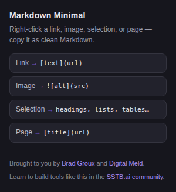

# Markdown Minimal

Right-click anything on the web, get clean Markdown on your clipboard. No popups, no ads, no accounts, no third-party servers, no clutter.

Right-click a link, an image, some selected text, or the page itself — Markdown Minimal copies it as clean Markdown, ready to drop into your notes, docs, or straight into your agent's context.

## Screenshots

That's the whole UI — everything else lives in the right-click menu.

## Features

- **Copy link as Markdown** — right-click any link, get `[link text](url)`.
- **Copy image as Markdown** — right-click any image, get ``.
- **Copy selection as Markdown** — select anything, get real Markdown: headings, **bold** / *italic*, links, nested lists, fenced code blocks with language detection, blockquotes, tables, images.
- **Copy page as Markdown** — right-click the page itself, get `[page title](url)`.
- **Quiet confirmation** — a tiny violet ✓ flashes on the toolbar icon when the copy lands.

## Permissions — and why each one is needed

| Permission | Why |
|---|---|
| `contextMenus` | Add the four "Copy as Markdown" items to your right-click menu. |
| `clipboardWrite` | Put the Markdown on your clipboard. |
| `activeTab` | Read the current tab's title and URL for "Copy page as Markdown". |
| Host `http://*/*`, `https://*/*` | Read the link, image, or selected text on the page you right-clicked. |

That's the whole list. Nothing is sent anywhere — see [docs/PRIVACY.md](docs/PRIVACY.md).

## FAQ

**Why isn't this on the Chrome Web Store?**
Publishing there costs a developer fee, adds review delays, and invites feature-creep pressure. Sideloading keeps it free, instant, and exactly this minimal.

**Does it upload anything anywhere?**
No. The only URLs the extension touches are the ones it pastes into your Markdown.

## About

Brought to you by [Brad Groux](https://twitter.com/bradgroux) and [Digital Meld](https://go.sstb.ai/extensions).

Learn to build tools like this in the [SSTB.ai community](https://go.sstb.ai/markdown-minimal).

## Changelog

See [CHANGELOG.md](CHANGELOG.md). Releases are cut from git tags (`v1.0.0`, `v1.1.0`, …).

## License

[MIT](LICENSE) — do whatever you want with it.
